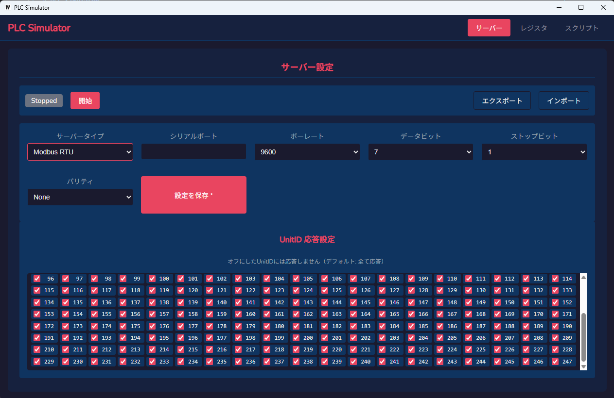

# PLC Simulator

Modbus TCP/RTU サーバー機能を持つ PLC シミュレーターです。GUI でレジスタの値を確認・編集でき、JavaScript でカスタムロジックを記述できます。



## 機能

- **Modbus サーバー**
  - Modbus TCP / RTU / RTU ASCII に対応
  - 全 UnitID (1-247) に応答（個別に無効化可能）
  - コイル、ディスクリート入力、保持レジスタ、入力レジスタ（各65536点）

- **レジスタ操作**
  - マトリクス表示でレジスタ値を一覧表示
  - キーボードナビゲーション対応
  - 10進数/16進数/8進数/2進数表示切替
  - 自動更新（100ms周期）

- **スクリプト機能**
  - JavaScript でカスタムロジックを記述
  - 周期実行（100ms〜1時間）
  - `plc` オブジェクトでレジスタにアクセス

- **プロジェクト管理**
  - 設定・レジスタ・スクリプトを JSON ファイルにエクスポート/インポート

## インストール

### 必要要件

- Go 1.21 以上
- Node.js 18 以上
- [Wails CLI](https://wails.io/docs/gettingstarted/installation)

### ビルド

```bash
# 依存関係のインストール
go mod tidy
cd frontend && npm install && cd ..

# プロダクションビルド
wails build
```

ビルド成果物は `build/bin/` に生成されます。

## 開発

```bash
# 開発モード（ホットリロード有効）
wails dev

# Go バインディングの再生成
wails generate module

# Go コードのビルド確認
go build ./...
```

## 使い方

### サーバー設定

1. 「サーバー」タブでサーバータイプ（TCP/RTU）を選択
2. 接続設定（アドレス、ポート等）を入力
3. 「開始」ボタンでサーバーを起動

### UnitID 応答設定

デフォルトでは全ての UnitID (1-247) に応答します。特定の UnitID への応答を無効にするには、該当のチェックボックスをオフにしてください。

### レジスタ操作

1. 「レジスタ」タブでレジスタタイプを選択
2. マトリクス表示でセルをクリックまたはキーボードで選択
3. Enter キーまたはダブルクリックで値を編集

### スクリプト

JavaScript でカスタムロジックを記述できます。

```javascript
// 保持レジスタ0の値をインクリメント
var value = plc.getHoldingRegister(0);
plc.setHoldingRegister(0, value + 1);

// コイル0をトグル
var coil = plc.getCoil(0);
plc.setCoil(0, !coil);
```

#### 利用可能な API

| メソッド                                 | 説明                         |
| ---------------------------------------- | ---------------------------- |
| `plc.getCoil(address)`                   | コイルの値を取得             |
| `plc.setCoil(address, value)`            | コイルの値を設定             |
| `plc.getDiscreteInput(address)`          | ディスクリート入力の値を取得 |
| `plc.setDiscreteInput(address, value)`   | ディスクリート入力の値を設定 |
| `plc.getHoldingRegister(address)`        | 保持レジスタの値を取得       |
| `plc.setHoldingRegister(address, value)` | 保持レジスタの値を設定       |
| `plc.getInputRegister(address)`          | 入力レジスタの値を取得       |
| `plc.setInputRegister(address, value)`   | 入力レジスタの値を設定       |

### エクスポート/インポート

「サーバー」タブの「エクスポート」「インポート」ボタンで、以下のデータを JSON ファイルとして保存・復元できます：

- サーバー設定
- UnitID 応答設定
- 全レジスタデータ
- スクリプト

## アーキテクチャ

```
internal/
├── domain/           # ドメイン層
│   ├── register/     # レジスタエンティティ
│   ├── script/       # スクリプトエンティティ
│   └── server/       # サーバー設定
├── application/      # アプリケーション層（PLCService）
└── infrastructure/   # インフラ層
    ├── modbus/       # Modbus サーバー実装
    └── scripting/    # JavaScript エンジン（goja）
```

## 技術スタック

- **バックエンド**: Go + [Wails v2](https://wails.io/)
- **フロントエンド**: React + TypeScript + Vite
- **Modbus**: [simonvetter/modbus](https://github.com/simonvetter/modbus)
- **JavaScript エンジン**: [goja](https://github.com/dop251/goja)

## ライセンス

MIT License

Copyright (c) 2026 bamchoh
