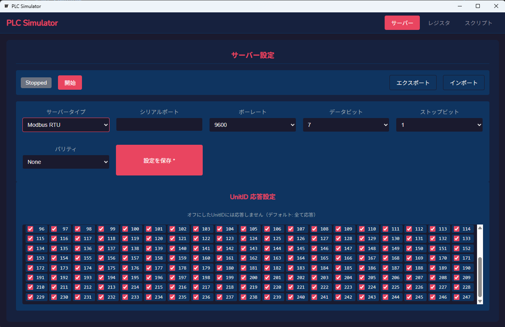

# PLC Simulator

Modbus（TCP/RTU/ASCII）と OPC UA に対応した PLC シミュレーターです。GUI でレジスタの値を確認・編集でき、JavaScript でカスタムロジックを記述できます。



## 機能

- **マルチプロトコル対応**
  - **Modbus TCP / Modbus RTU / Modbus ASCII** を独立したサーバーとして個別に追加・起動可能
    - 全 UnitID (1-247) に応答（個別に無効化可能）
    - コイル、ディスクリート入力、保持レジスタ、入力レジスタ（各65536点）
  - **OPC UA** サーバーを起動可能（セキュリティなし・匿名認証）
    - 変数管理で定義した変数をノードとして公開
    - 構造体フィールドと配列要素を個別のノードとしてブラウズ可能
    - フィールド・要素単位でのサブスクリプション（変更通知）に対応
    - スカラー・配列・構造体の読み書き対応

- **複数サーバー同時実行**
  - 例: Modbus TCP と OPC UA を同時に起動可能
  - 各サーバーは独立したメモリ空間を持つ
  - サーバーパネルで個別に設定・起動・停止が可能

- **変数管理（v0.0.8〜）**
  - **IEC 61131-3準拠のデータ型**
    - スカラー型: BOOL, SINT, INT, DINT, USINT, UINT, UDINT, REAL, LREAL, STRING[n], TIME, DATE, TIME_OF_DAY, DATE_AND_TIME
    - 配列型: ARRAY[型;サイズ]（例: ARRAY[INT;10]）
    - 構造体型: カスタム構造体定義（ネスト可能）
    - 時間・日付型はメモリ上で数値として保存（TIME: int32/2ワード、DATE: uint64/4ワード、TIME_OF_DAY: uint32/2ワード、DATE_AND_TIME: uint64/4ワード）
  - 構造体フィールドと配列要素をフラット化して表示
  - 再帰的値編集ダイアログ（複雑なデータ構造に対応）
  - プロトコルマッピング: 変数を複数プロトコルのメモリアドレスにマッピング
  - マッピング競合警告: 同じレジスタを複数の変数で使用している場合にダイアログと一覧の両方で警告表示

- **レジスタ操作**
  - マトリクス表示でレジスタ値を一覧表示
  - キーボードナビゲーション対応
  - 10進数/16進数/8進数/2進数表示切替
  - 16bit/32bit/64bit 表示（リトルエンディアン/ビッグエンディアン対応）
  - 自動更新（100ms周期）
  - Modbus アドレスは 1オリジン表示（内部は 0ベース）

- **モニタリング機能**
  - 任意のレジスタを登録してリアルタイム監視
  - プロトコル、メモリエリア、アドレス、ビット幅、エンディアン、表示形式を設定可能
  - 複数サーバー起動時は異なるプロトコルのレジスタを同一リストで監視可能
  - ドラッグ＆ドロップで並び替え対応
  - 設定はファイルに自動保存（次回起動時に復元）

- **スクリプト機能**
  - JavaScript でカスタムロジックを記述
  - const/let 対応（IIFE wrapping）
  - 実行時エラーを GUI に表示（タイムスタンプ付き、クリアボタン）
  - `console.log()` の出力をコンソールパネルに表示（スクリプト名・タイムスタンプ付き、クリアボタン付き）
  - 周期実行（100ms〜1時間）
  - `plc` オブジェクトでメモリアクセス（プロトコル非依存）

- **プロジェクト管理**
  - 設定・レジスタ・スクリプト・変数・モニタリング項目を JSON ファイルにエクスポート/インポート

## インストール

### 必要要件

- Go 1.21 以上
- Node.js 18 以上
- [Wails CLI](https://wails.io/docs/gettingstarted/installation)

### ビルド

```bash
# 依存関係のインストール
go mod tidy
cd frontend && npm install && cd ..

# プロダクションビルド
wails build
```

ビルド成果物は `build/bin/` に生成されます。

## 開発

```bash
# 開発モード（ホットリロード有効）
wails dev

# Go バインディングの再生成
wails generate module

# Go コードのビルド確認
go build ./...
```

## 使い方

### サーバー設定

1. 「サーバー」タブにサーバー一覧が表示される（初期状態: Modbus TCP）
2. 「サーバーを追加」ボタンで新しいプロトコルのサーバーを追加
3. 各サーバーの「設定」ボタンをクリックして接続設定（アドレス、ポート等）を変更
4. 「開始」ボタンでサーバーを起動（各サーバーを独立して開始/停止可能）
5. 複数のサーバーを同時に起動することが可能

### UnitID 応答設定

デフォルトでは全ての UnitID (1-247) に応答します。特定の UnitID への応答を無効にするには、該当のチェックボックスをオフにしてください。（UnitID をサポートするプロトコルのみ表示）

### レジスタ操作

1. 「レジスタ」タブを選択
2. 複数サーバーが起動している場合は上部のプロトコル選択で対象を切り替え
3. メモリエリアを選択して「一覧表示」サブタブでマトリクス表示
4. セルをクリックまたはキーボードで選択
5. Enter キーまたはダブルクリックで値を編集

### モニタリング

1. 「レジスタ」タブの「モニタリング」サブタブを選択
2. 「追加」ボタンで監視したいレジスタを登録
3. 複数サーバー起動時はプロトコルを選択してから、メモリエリア・開始アドレス・個数・ビット幅・エンディアン・表示形式を設定
4. 登録した項目の値がリアルタイムで更新される
5. 値をクリックして直接書き込み可能

### 変数管理

「変数」タブで IEC 61131-3 準拠の変数を管理できます。

1. 「変数を追加」ボタンで新しい変数を作成
2. 型カテゴリ（スカラー、配列、構造体）を選択
3. データ型を選択（STRING の場合はバイト長も指定）
4. 変数をクリックして値を編集
5. 「マッピング」ボタンでプロトコルのメモリアドレスにマッピング

#### 構造体型の管理

構造体型は「構造体型管理」ボタンから登録・編集できます。

- **新規登録**: 型名とフィールドを定義して「型を登録」
- **編集**: 既存の構造体型の「編集」ボタンをクリックして定義を変更し「更新」
- **削除**: 「削除」ボタンで構造体型を削除

フィールドはスカラー、配列、構造体のいずれかを指定可能（ネスト対応）。編集時は型名の変更はできませんが、フィールドの追加・削除・変更が可能です。

### スクリプト

JavaScript でカスタムロジックを記述できます。const/let が使用可能です。

```javascript
// プロトコル非依存の汎用 API（推奨）
const bit = plc.readBit("coil", 0);
plc.writeBit("coil", 0, !bit);

const word = plc.readWord("holding_register", 0);
plc.writeWord("holding_register", 0, word + 1);

// Modbus 互換 API（下位互換性のため残存）
const value = plc.getHoldingRegister(0);
plc.setHoldingRegister(0, value + 1);
```

実行時エラーはスクリプト一覧に表示されます（タイムスタンプ付き）。

#### 利用可能な API

**プロトコル非依存 API（推奨）**:

| メソッド                              | 説明                                           |
| ------------------------------------- | ---------------------------------------------- |
| `plc.readBit(area, address)`          | 指定メモリエリアのビットを読み取り             |
| `plc.writeBit(area, address, value)`  | 指定メモリエリアのビットを書き込み             |
| `plc.readWord(area, address)`         | 指定メモリエリアのワード（16bit）を読み取り   |
| `plc.writeWord(area, address, value)` | 指定メモリエリアのワード（16bit）を書き込み   |

メモリエリアは Modbus の "coils", "discreteInputs", "holdingRegisters", "inputRegisters" です。

**変数アクセス API**:

| メソッド                                         | 説明                                   |
| ------------------------------------------------ | -------------------------------------- |
| `plc.readVariable(name)`                         | 変数名で値を読み取り（文字列/数値）    |
| `plc.writeVariable(name, value)`                 | 変数名で値を書き込み                   |
| `plc.readArrayElement(name, index)`              | 配列変数の要素を読み取り               |
| `plc.writeArrayElement(name, index, value)`      | 配列変数の要素を書き込み               |
| `plc.readStructField(name, fieldName)`           | 構造体変数のフィールドを読み取り       |
| `plc.writeStructField(name, fieldName, value)`   | 構造体変数のフィールドを書き込み       |
| `plc.getVariables()`                             | 全変数名の一覧を取得                   |

**TIME/DATE シンタックスシュガー**:

読み取り〜数値変換〜書き込みをワンステップで実行します。

| メソッド                             | 型         | 内部値 | 説明                                            |
| ------------------------------------ | ---------- | ------ | ----------------------------------------------- |
| `plc.readTimeMs(name)`               | TIME       | ms     | TIME 変数をミリ秒（数値）で読み取り             |
| `plc.writeTimeMs(name, ms)`          | TIME       | ms     | ミリ秒（数値）を TIME 変数に書き込み            |
| `plc.readDateSec(name)`              | DATE       | 秒     | DATE 変数を Unix 秒（数値）で読み取り           |
| `plc.writeDateSec(name, sec)`        | DATE       | 秒     | Unix 秒（数値）を DATE 変数に書き込み           |
| `plc.readTimeOfDayMs(name)`          | TIME_OF_DAY | ms    | TOD 変数をミリ秒（数値）で読み取り              |
| `plc.writeTimeOfDayMs(name, ms)`     | TIME_OF_DAY | ms    | ミリ秒（数値）を TOD 変数に書き込み             |
| `plc.readDateAndTimeSec(name)`       | DATE_AND_TIME | 秒  | DT 変数を Unix 秒（数値）で読み取り             |
| `plc.writeDateAndTimeSec(name, sec)` | DATE_AND_TIME | 秒  | Unix 秒（数値）を DT 変数に書き込み             |

```javascript
// TIME_OF_DAY 変数に 1 秒加算する例
plc.writeTimeOfDayMs("TOD1", plc.readTimeOfDayMs("TOD1") + 1000);

// DATE 変数を 1 日進める例
plc.writeDateSec("date1", plc.readDateSec("date1") + 86400);
```

**TIME/DATE 文字列変換 API**:

| メソッド                          | 説明                                          |
| --------------------------------- | --------------------------------------------- |
| `plc.parseTime(str)`              | `"T#1h30m"` → ミリ秒（number）               |
| `plc.formatTime(ms)`              | ミリ秒（number） → `"T#1h30m"`               |
| `plc.parseDate(str)`              | `"D#2024-01-01"` → Unix 秒（number）         |
| `plc.formatDate(sec)`             | Unix 秒（number） → `"D#2024-01-01"`         |
| `plc.parseTimeOfDay(str)`         | `"TOD#12:30:15"` → ミリ秒（number）          |
| `plc.formatTimeOfDay(ms)`         | ミリ秒（number） → `"TOD#12:30:15"`          |
| `plc.parseDateAndTime(str)`       | `"DT#2024-01-01-12:30:15"` → Unix 秒（number） |
| `plc.formatDateAndTime(sec)`      | Unix 秒（number） → `"DT#2024-01-01-12:30:15"` |

**Modbus 互換 API**:

| メソッド                                 | 説明                         |
| ---------------------------------------- | ---------------------------- |
| `plc.getCoil(address)`                   | コイルの値を取得             |
| `plc.setCoil(address, value)`            | コイルの値を設定             |
| `plc.getDiscreteInput(address)`          | ディスクリート入力の値を取得 |
| `plc.setDiscreteInput(address, value)`   | ディスクリート入力の値を設定 |
| `plc.getHoldingRegister(address)`        | 保持レジスタの値を取得       |
| `plc.setHoldingRegister(address, value)` | 保持レジスタの値を設定       |
| `plc.getInputRegister(address)`          | 入力レジスタの値を取得       |
| `plc.setInputRegister(address, value)`   | 入力レジスタの値を設定       |

### エクスポート/インポート

「サーバー」タブの「エクスポート」「インポート」ボタンで、以下のデータを JSON ファイルとして保存・復元できます：

- 全サーバーの設定（プロトコル、接続設定）—複数サーバーの構成を含む
- UnitID 応答設定
- 全メモリエリアのデータ（サーバーごと）
- スクリプト
- モニタリング項目（プロトコル情報含む）

エクスポートファイルは Version 3 形式で保存されます。旧バージョン（Version 1/2）のファイルもインポート可能です。

## アーキテクチャ

```
internal/
├── domain/           # ドメイン層
│   ├── protocol/     # プロトコル共通インターフェース
│   ├── variable/     # 変数エンティティ（IEC 61131-3データ型）
│   ├── script/       # スクリプトエンティティ
│   └── datastore/    # DataStore 共通定義
├── application/      # アプリケーション層
│   ├── plc_service.go  # メインサービス（複数サーバー管理・モニタリング・変数管理含む）
│   └── dto.go          # DTO 定義（ServerInstanceDTO, ServerConfigDTO 等）
└── infrastructure/   # インフラ層（プロトコル実装）
    ├── modbus/       # Modbus サーバー実装（TCP / RTU / ASCII の3ファクトリー）
    ├── opcua/        # OPC UA サーバー実装（PLCNameSpace カスタム名前空間）
    ├── adapter/      # 変数とDataStoreのアダプタ・VariableStoreAccessor
    └── scripting/    # JavaScript エンジン（goja）
```

PLCService は `servers map[protocol.ProtocolType]*serverInstance` で複数のサーバーインスタンスを管理します。Modbus の各バリアント（`"modbus-tcp"`, `"modbus-rtu"`, `"modbus-ascii"`）および OPC UA（`"opcua"`）は独立したプロトコルタイプとして扱われるため、組み合わせて同時に起動できます。

## 設定ファイル

モニタリング設定は以下の場所に自動保存されます：

- **Windows**: `%APPDATA%\PLCSimulator\monitoring_config.json`
- **macOS**: `~/Library/Application Support/PLCSimulator/monitoring_config.json`
- **Linux**: `~/.config/PLCSimulator/monitoring_config.json`

## 技術スタック

- **バックエンド**: Go + [Wails v2](https://wails.io/)
- **フロントエンド**: React + TypeScript + Vite
- **Modbus**: [simonvetter/modbus](https://github.com/simonvetter/modbus)
- **OPC UA**: [gopcua](https://github.com/gopcua/opcua) v0.8.0
- **JavaScript エンジン**: [goja](https://github.com/dop251/goja)

## ライセンス

MIT License

Copyright (c) 2026 bamchoh
